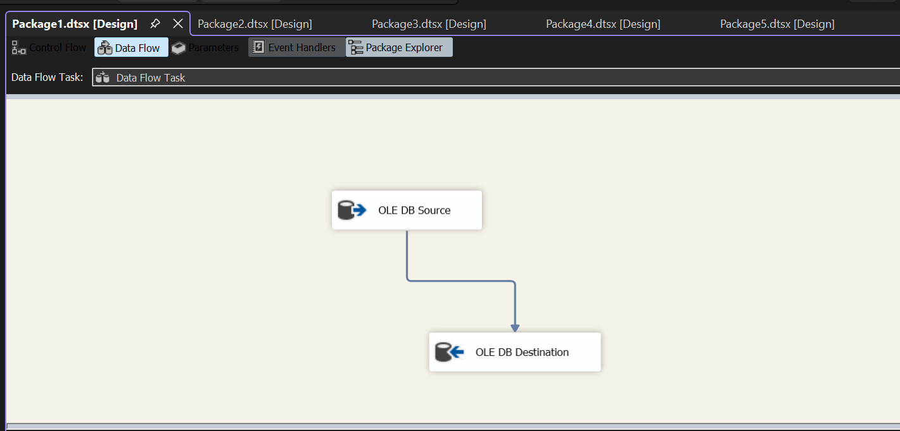
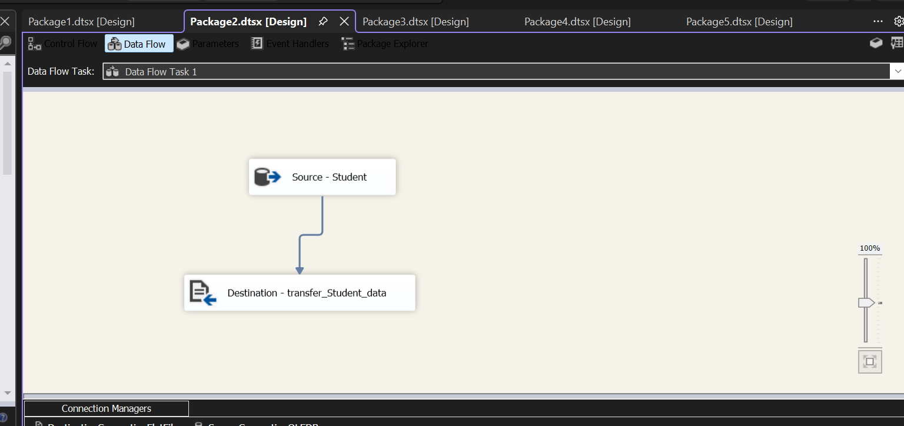
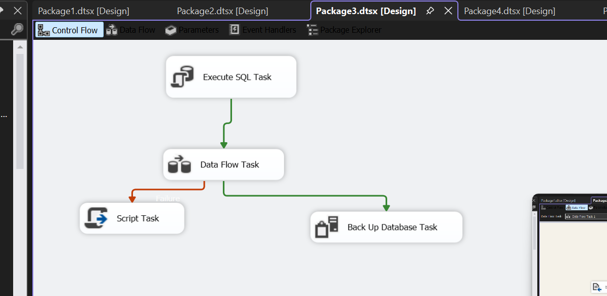
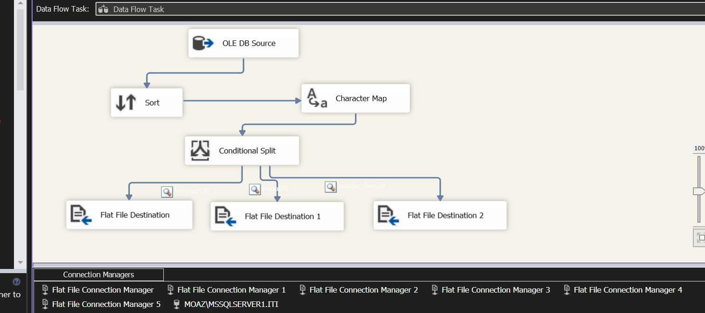
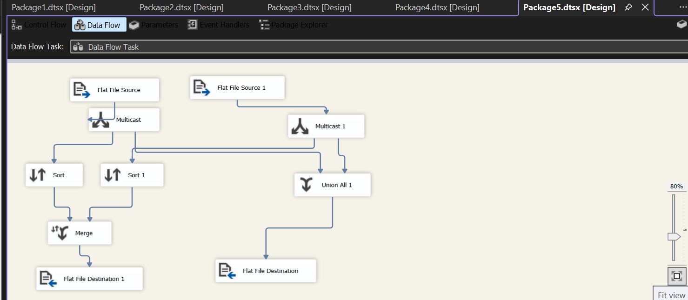

# SSIS-ETL-Projects

This repository contains multiple ETL packages developed using SQL Server Integration Services (SSIS).

## Package 1
Transfer data from SQL Server source table to destination table using OLE DB Source and OLE DB Destination.

## Package 2
Extract student data and load it into a staging table.

## Package 3
Control flow package including:
- Execute SQL Task
- Data Flow Task
- Script Task
- Database Backup Task

## Package 4
Data transformation pipeline including:
- Sort
- Character Map
- Conditional Split
- Export data to multiple flat files

## Package 5
Multiple source integration including:
- Multicast
- Sort
- Merge
- Union All
- Export results to flat files
